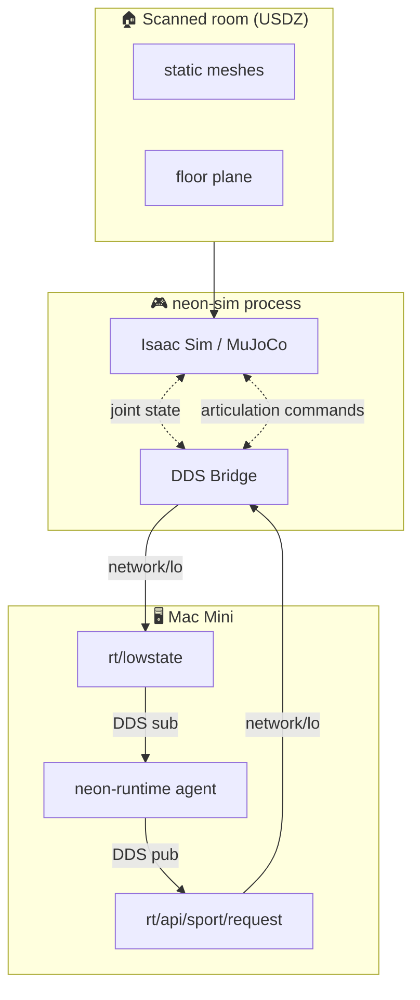

# Architecture

## The big picture

## Why DDS as the interface?

The real G1 runs `sport_mode` on its Jetson, which:

- Publishes `rt/lowstate` at 500 Hz (joint state + IMU)
- Publishes `rt/bmsstate` at 1 Hz (battery)
- Subscribes to `rt/api/sport/request` for RPC commands

`neon-runtime` is the client side of this. It has **zero knowledge**
that there's a sim in the loop. This gives us:

- ✅ Zero code change in `neon-runtime`
- ✅ Bit-identical motion guard, battery guard, safety logic
- ✅ Switch sim/real with one env var (`G1_NETWORK_INTERFACE=lo` vs `en0`)

## Why two backends?

**Isaac Sim** is the right answer — native USD, Unitree ships G1 USD, PBR
rendering of your scan textures. But it requires:

- NVIDIA RTX GPU (~8GB+ VRAM)
- Linux or Windows-WSL
- 30GB+ of disk for the install

**MuJoCo** is the pragmatic answer — runs on your Mac Mini today. It:

- Loads G1 from XMLs shipped with `unitree_mujoco`
- Loads your room as a decoration mesh (no PBR, but functional)
- Shares the same DDS bridge with Isaac

Pick the one that fits your hardware. The code ahead of the backend is shared.

## What the bridge does

See [DDS bridge](dds-bridge.md) for details. TL;DR:

1. **Upstream** (sim → DDS): reads Isaac/MuJoCo joint state, packs into
   `unitree_hg.LowState_`, publishes at 500 Hz
2. **Downstream** (DDS → sim): subscribes to `rt/api/sport/request`,
   parses FSM IDs and velocities, drives articulation

## What neon-sim is NOT

- ❌ A reinforcement learning platform (use Isaac Lab for that)
- ❌ A perfect hardware simulator (motor dynamics are approximate)
- ❌ A replacement for hardware testing (walking on real floors beats everything)

It's a way to de-risk new behaviors before they meet 30kg of metal.
