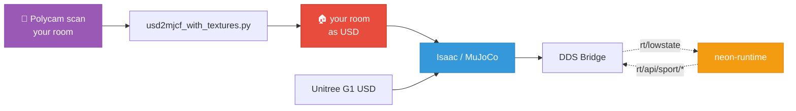

# 🦿🪐 neon-sim

> Drive your Unitree G1 through **your actual room** (scanned with Polycam) using the same `neon-runtime` agent that controls the real robot.

[Get started →](quickstart.md){ .md-button .md-button--primary }
[See architecture →](architecture.md){ .md-button }
[Pairs with neon-runtime →](https://github.com/cagataycali/neon-runtime){ .md-button }

## What it does

1. You scan your room with **Polycam** → get a `.usdz` file
2. neon-sim preprocesses it (Y-up → Z-up, adds floor, tags colliders)
3. Spawns the G1 robot in your scanned space
4. **Publishes the same DDS topics as the real robot** — so your neon agent
   doesn't know it's in a simulator

## Two backends

| Backend | Platform | Strengths |
|---|---|---|
| 🥇 **Isaac Sim** | Linux (CUDA) / Windows (WSL) | Native USDZ, photoreal, Unitree ships official G1 model |
| 🪶 **MuJoCo** | macOS / Linux / Windows | Works today, no GPU required, needs OBJ conversion |

Both share the **same DDS bridge** — pick whichever is easier for you.

## Why this is cool

Test reckless things in sim. Deploy working things to hardware. The same agent does both.

## See also

- 🤖 [neon-runtime](https://github.com/cagataycali/neon-runtime) — the agent that runs on your real G1
- 📋 [g1-runtime](https://github.com/cagataycali/g1-runtime) — hardware reverse-engineering notes
- 📱 [Polycam](https://poly.cam) — 3D scanning app (LiDAR on iPhone Pro, photogrammetry elsewhere)
- 🧪 [unitree_mujoco](https://github.com/unitreerobotics/unitree_mujoco) — official G1 MJCF models

